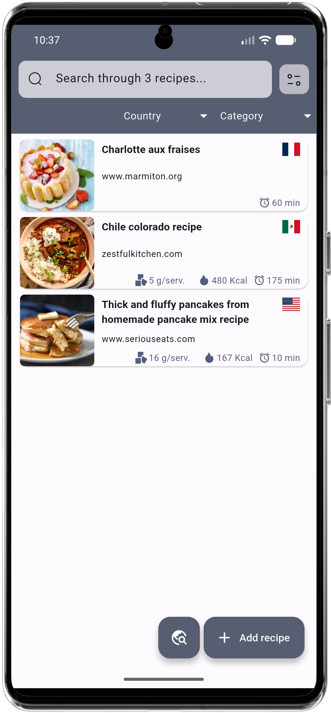
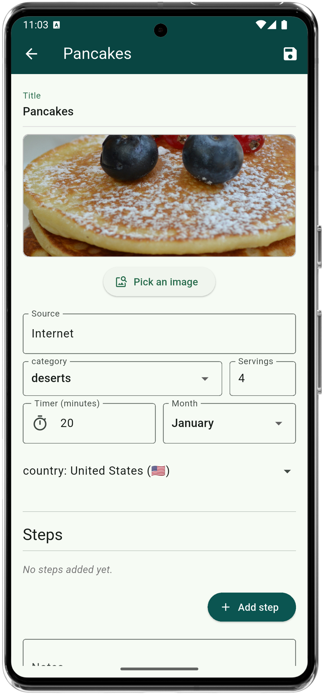
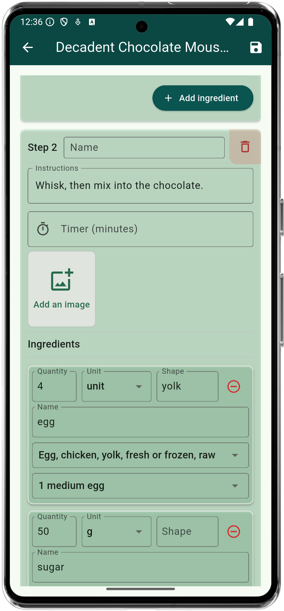
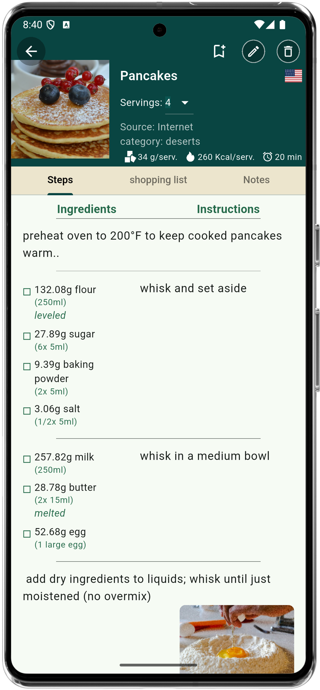
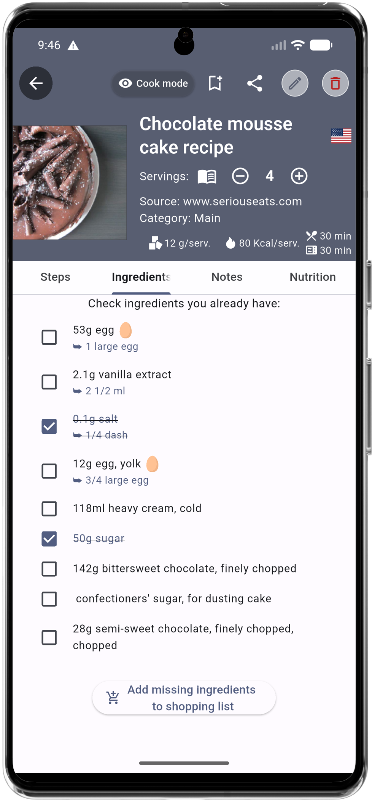
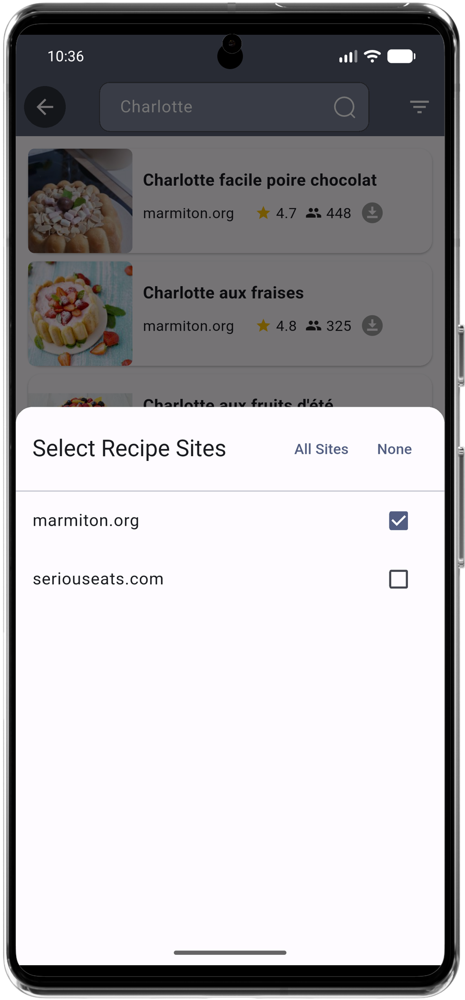
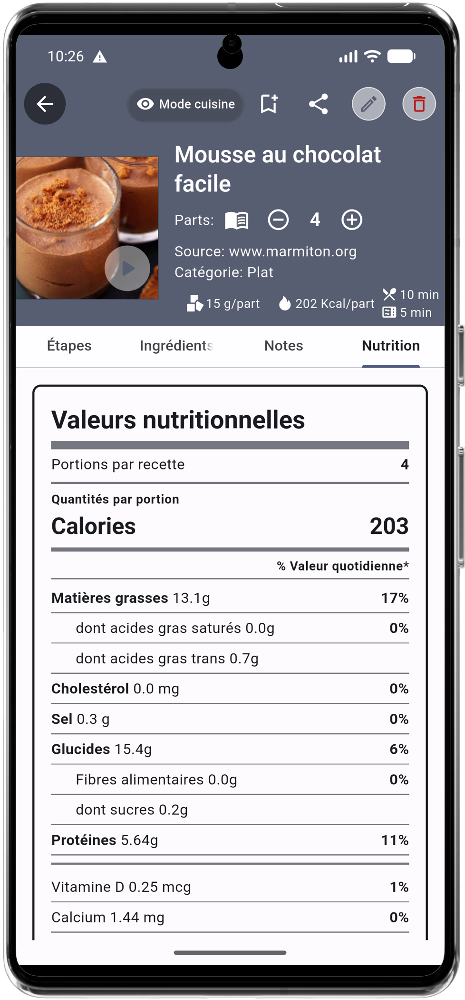

# shefu

Shefu is an **offline** open source (GPLv3) digital cookbook and kitchen assistant, designed to help you track, organize, and cook your recipes in your native language. All of this with local storage (no internet required!).

<a href='https://play.google.com/store/apps/details?id=fr.orvidia.shefu'>
  

</a>

Key Features:

- **Organize Your Recipes**: Easily add, edit, and search your categorized recipes (mains, desserts, etc.). Use advanced search, and filters (like category, country) to find exactly what you need, right when you need it. Search 'egg' and you'll find all your recipes including eggs, even meringue!
- **Scan Recipes with OCR**: Have a recipe in a book or magazine? Just snap a photo! Shefu's built-in OCR (Optical Character Recognition) intelligently extracts the title, ingredients, and steps. (Note: OCR performs best with clear, well-structured text layouts).
- **Detailed Step-by-Step View**: Follow recipes with clear, easy-to-read instructions. Add images and optional timers to individual steps. Ingredients quantities are automatically adapted to desired servings.
- **Nutrient Tracking & Insights**: Link your ingredients to an extensive included offline nutrient database (Source: Santé Canada). Shefu automatically calculates all nutritional values per serving based on your ingredients and specified serving size, helping you make more informed dietary choices. Refer to nutrition tab on recipes.
- **Offline text to speech**: let the application speak the steps for you, while you are busy cooking.
- **Shopping List Generation**: Automatically generate a convenient shopping list based on the ingredients needed for your selected recipes. *(Note: shopping list is only available until the application is closed)*
- **Multi-language Support**: Fully available in English, French, Japanese, and Hungarian.
- **Works Offline**: Your recipes are stored locally on your device, ensuring you always have access. No internet required to use the application (except for recipe import, see below).
- **Internet recipes import**: Put a supported site url in source when creating a recipe to import it (see list below). Advanced scraper compatible with images, FAQs, nutritional values when available.
- **Video player**: Put a video url on recipe to play it when you cook. Video urls are automatically saved when importing recipes from compatible websites.
- **Internet recipes search**: On supported sites, you can browse recipes and import recipe in one click.

Supported languages:

  - English (🇺🇸)
  - Français (🇫🇷)
  - 日本語 (🇯🇵)
  - Magyar (🇭🇺)

Feel free to help!

## News

New in 3.4.0: Video player

New in v2: nutritional informations are automatically generated (for EN and FR only)! Source: Santé Canada (Fichier canadien sur les éléments nutritifs, 2015)-> https://www.canada.ca/fr/sante-canada/services/aliments-nutrition/saine-alimentation/donnees-nutritionnelles/fichier-canadien-elements-nutritifs-fcen-2015.html. This is all done on-device with no internet access required.

**Note: you need to choose ingredients and factors from the drop-down menus to get the nutritional values calculated.**

## Sample Screenshots

Sample:

Documentation will come later.

Supported Recipe Websites for import:

| USA 🇺🇸 Supported Website **(30)** |
|-------------------|
| ✅ [ABeautifulMess.com](https://www.abeautifulmess.com) |
| ✅ [Aflavorjournal.com](https://www.aflavorjournal.com) |
| ✅ [Alexandracooks.com](https://alexandracooks.com) |
| ✅ [AllRecipes.com](https://www.allrecipes.com) |
| ✅ [Ambitiouskitchen.com](https://www.ambitiouskitchen.com) |
| ✅ [Anovaculinary.com](https://www.anovaculinary.com) |
| ✅ [Bakewithzoha.com](https://www.bakewithzoha.com) |
| ✅ [Budgetbytes.com](https://www.budgetbytes.com) |
| ✅ [Cafedelites.com](https://www.cafedelites.com) |
| ✅ [Cakemehometonight.com](https://www.cakemehometonight.com) |
| ✅ [Cambreabakes.com](https://www.cambreabakes.com) |
| ✅ [Castironketo.net](https://www.castironketo.net) |
| ✅ [Cdkitchen.com](https://www.cdkitchen.com) |
| ✅ [Damndelicious.net](https://www.damndelicious.net) |
| ✅ [Eatingwell.com](https://www.eatingwell.com) |
| ✅ [Evolvingtable.com](https://www.evolvingtable.com) |
| ✅ [HelloFresh.com](https://www.hellofresh.com) |
| ✅ [Lanascooking.com](https://www.lanascooking.com) |
| ✅ [Lecremedelacrumb.com](https://www.lecremedelacrumb.com) |
| ✅ [mybakingaddiction.com](https://www.mybakingaddiction.com) |
| ✅ [Recipetineats.com](https://www.recipetineats.com) |
| ✅ [SeriousEats.com](https://www.seriouseats.com) |
| ✅ [SugarHero.com](https://www.sugarhero.com) |
| ✅ [Thekitchn.com](https://www.thekitchn.com) |
| ✅ [Therecipecritic.com](https://www.therecipecritic.com) |
| ✅ [Vanillaandbean.com](https://www.vanillaandbean.com) |
| ✅ [Wellplated.com](https://www.wellplated.com) |
| ✅ [WhatsGabyCooking.com](https://www.whatsgabycooking.com) |
| ✅ [ZenBelly.com](https://www.zenbelly.com) |
| ✅ [ZestfulKitchen.com](https://www.zestfulkitchen.com) |
| More sites 🚧 In progress |

| France 🇫🇷 Supported Website **(13)** |
|-------------------|
| ✅ [750g.com](https://www.750g.com) |
| ✅ [Atelierdeschefs.fr](https://www.atelierdeschefs.fr) |
| ✅ [Chefsimon.com](https://www.chefsimon.com) |
| ✅ [Cuisineaz.com](https://www.cuisineaz.com) |
| ✅ [Cuisineactuelle.fr](https://www.cuisineactuelle.fr) |
| ✅ [Cuisine.journaldesfemmes.fr](https://cuisine.journaldesfemmes.fr) |
| ✅ [Giallozafferano.fr](https://www.giallozafferano.fr) |
| ✅ [HelloFresh.fr](https://www.hellofresh.fr) |
| ✅ [Marmiton.org](https://www.marmiton.com) |
| ✅ [Moulinex.fr](https://www.moulinex.fr) |
| ✅ [Lacuisinedessouvenirs.com](https://www.lacuisinedessouvenirs.com) |
| ✅ [Ptitchef.com](https://www.ptitchef.com) |
| ✅ [Supertoinette.com](https://www.supertoinette.com) |
| More sites 🚧 In progress |

| Other Supported Websites **(14)** | Country |
|-------------------|:--------|
| ✅ [Akispetretzikis.com](https://www.akispetretzikis.com) | 🇬🇷 Greece |
| ✅ [BBCgoodfood.com](https://www.bbcgoodfood.com) | 🇬🇧 UK |
| ✅ [Foodnetwork.co.uk](https://www.foodnetwork.co.uk) | 🇬🇧 UK |
| ✅ [Greatbritishchefs.com](https://www.greatbritishchefs.com) | 🇬🇧 UK |
| ✅ [JamieOliver.com](https://www.jamieoliver.com) | 🇬🇧 UK |
| ✅ [Kitchenstories.com](https://www.kitchenstories.com) | 🇩🇪 Germany |
| ✅ [Kochbar.de](https://www.kochbar.de) | 🇩🇪 Germany |
| ✅ [Koket.se](https://www.koket.se) | 🇸🇪 Sweden |
| ✅ [miljuschka.nl](https://miljuschka.nl) | 🇳🇱 Netherlands |
| ✅ [Wdr.de](https://www1.wdr.de) | 🇩🇪 Germany |
| ✅ [Yemek.com](https://www.yemek.com) | 🇹🇷 Turkey |
| ✅ [Zaubertopf.de](https://www.zaubertopf.de) | 🇩🇪 Germany |
| ✅ [Zeit.de](https://www.zeit.de) | 🇩🇪 Germany |
| ✅ [Cookpad.com](https://www.cookpad.com) | 🌏 World |
| More sites | 🚧 In progress |

**Recipe scraping now follows/uses https://github.com/hhursev/recipe-scrapers format to support as much websites as possible.**

Tools SVG icons from https://opensourcesvgicons.com/

Nutrients SVG icons from https://www.svgrepo.com/

## Comparison with other applications

| Feature                                 | Shefu                        | Paprika Recipes Manager 3 (Demo) | Paprika recipe manager 3 (unlocked full version) |
|------------------------------------------|------------------------------|----------------------------------------|--------------------------------------|
| **Licence**                               | GPLv3, open source    | Proprietary                                  | Proprietary                 |
| Ad-Free                             | ✅ Yes                       | ✅ Yes                                 | ✅ Yes                               |
| Require online account to use       | ✅ No                        | ✅ No                                  | ✅ No                                |
| Local Storage                       | ✅ Yes (fully local)          | ✅ Yes                                 | ✅ Yes                               |
| Works Offline                       | ✅ Yes                       | ✅ Yes                                 | ✅ Yes                               |
| Platforms (price in $/€)                           | Android (Free)   | Android, iOS, Windows (Free)            | Android (4.99), iOS (4.99), Mac(34.99), Windows (29.99)           |
| Dark Mode                           | ✅ Yes                       | ✅ Yes                               | ✅ Yes                             |
| Full text search                    | ✅ Yes                       | ✅ Yes                                 | ✅ Yes                               |
| Cook mode (keep screen awake)       | ✅ Yes                       | ✅ Yes                                 | ✅ Yes                               |
| Multi-language Support              | ✅ Yes (EN, FR, JA, HU)       | ✅ Yes (16 languages)                      | ✅ Yes (16 languages)                    |
| Recipe Import (Web)                 | ✅ Yes (many sites)           | ✅ Yes (many sites)                    | ✅ Yes (many sites)                  |
| Import Recipes from webpages        | ✅ Yes (from web)             | ✅ Yes                                 | ✅ Yes                               |
| **Web search for import**               | ✅ Optimized web search (supported sites, perfect import) | ✅ Full browser in-app (average import quality) | ✅ Full browser in-app (average import quality) |
| Print recipe                        | ✅ Yes (basic)                | ✅ Yes (with many options)             | ✅ Yes (with many options)           |
| Shopping List                       | ✅ Yes (basic)                | ✅ Multiple (advanced)                 | ✅ Multiple (advanced)               |
| Scale ingredients to desired serving size | ✅ Yes                  | ✅ Yes                                 | ✅ Yes                               |
| Convert ingredients between metric and imperial | ✅ Yes             | ✅ Yes                                 | ✅ Yes                               |
| Auto-generated Timers               | ✅ Yes (max 1 per step)       | ✅ Yes (unlimited)                     | ✅ Yes (unlimited)                   |
| **Favorites**                           | ❌ Unavailable                | ✅ Available                           | ✅ Available                         |
| **Duplicate recipe**                    | ❌ Unavailable                | ✅ Available                           | ✅ Available                         |
| **Import Recipes from file**            | ❌ Not yet                    | ✅ Yes                                 | ✅ Yes                               |
| **Images per recipe**                   | 1 (+1 for each step)         | Multiple | Multiple (with cloud sync)           |
| **Recipe display**                      | Ingredients & steps on one page, per step | Ingredients and instructions on separate pages | Ingredients and instructions on separate pages |
| **Export Recipes**                      | ❌ Not yet                    | ✅ Yes                                 | ✅ Yes                               |
| **Monthly Meal Planner**                | ❌ No                         | ✅ Yes                                 | ✅ Yes                               |
| **Cloud Sync between devices**          | ❌ No                         | ❌ No                                  | ✅ Yes                               |
| **Maximum number of recipes**                   | ✅ Unlimited                       | ❌ 50                         | ✅ Unlimited                               |
| **Nutrient Tracking**                   | ✅ Yes (offline, EN/FR)       | ❌ No                                  | ❌ No                                |
| **Auto-generated nutrition table**      | ✅ Yes (offline, EN/FR)       | ❌ No                                  | ❌ No                                |
| **Ingredients set on**                  | Recipe steps                  | Recipe                                 | Recipe                               |
| **Step Images**                         | ✅ Yes (1 per step)                       | ❌ No                                  | ❌ No                                |
| **Video Player**                        | ✅ Yes                       | ❌ No                                  | ❌ No                                |
| **OCR Recipe Scan**                     | ✅ Yes       | ❌ No                                  | ❌ No                                |

_Feature comparison as of 02/2026. For more details, see each app's documentation._
