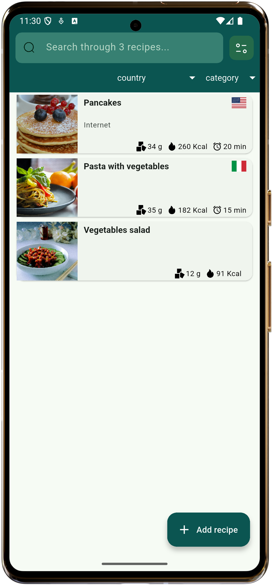
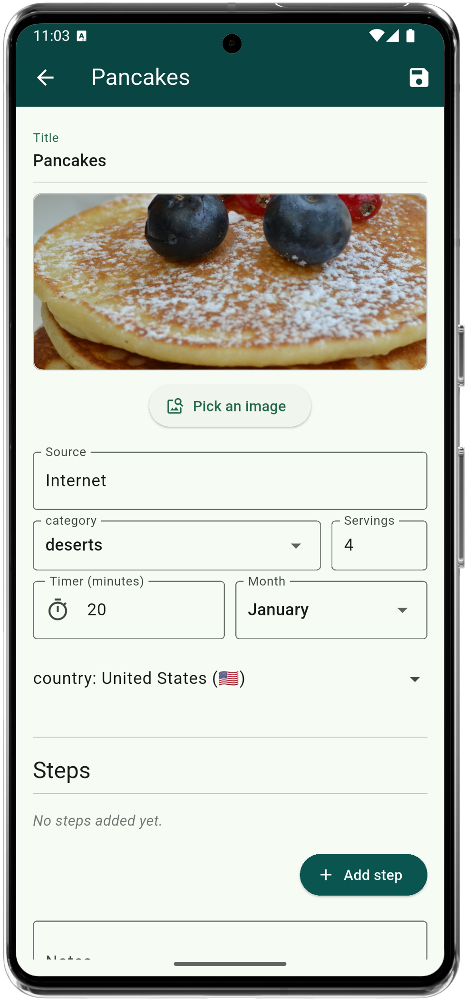
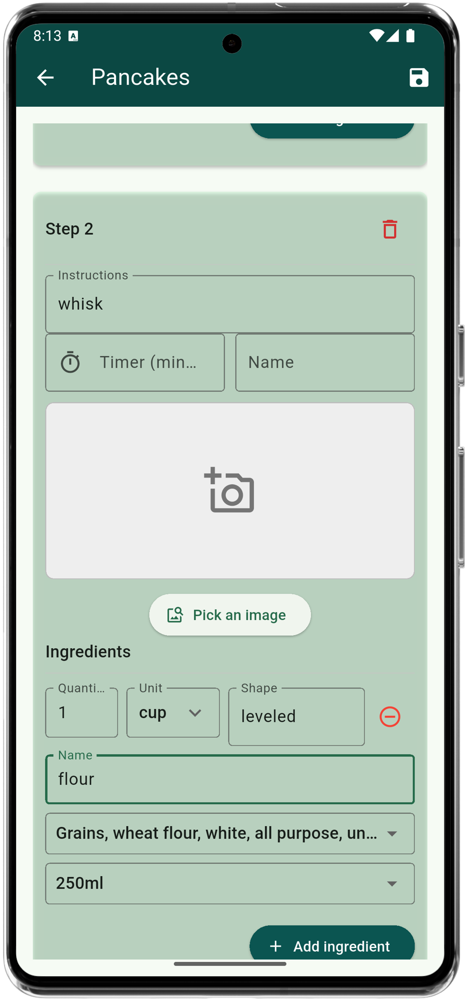
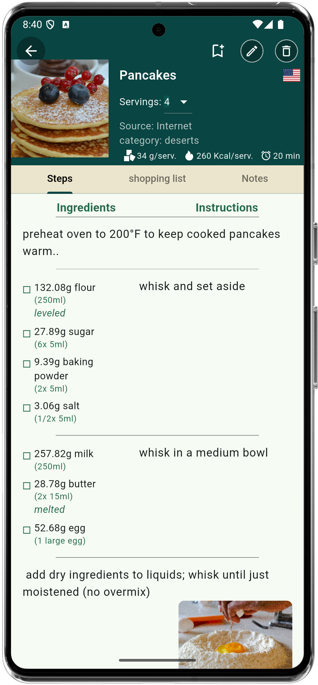
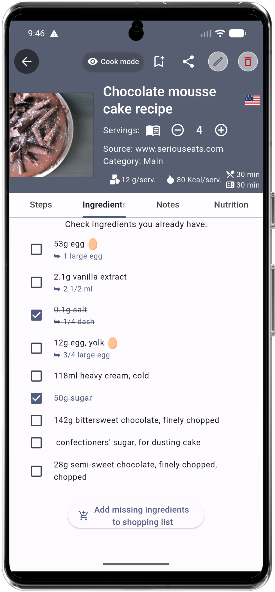
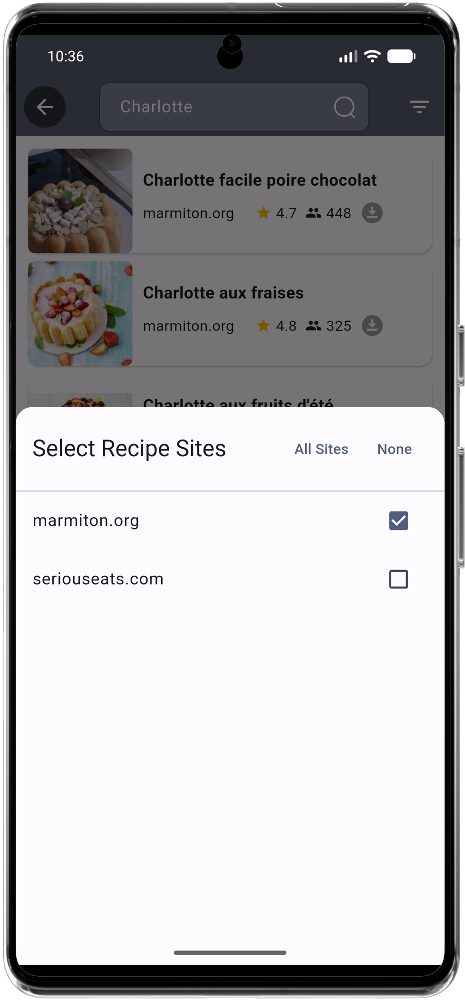
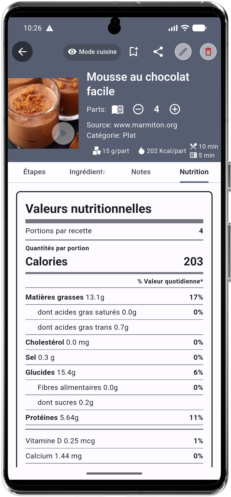

# shefu

Shefu is an **offline** open source (GPLv3) digital cookbook and kitchen assistant, designed to help you track, organize, and cook your recipes in your native language. All of this with local storage (no internet required!).

<a href='https://play.google.com/store/apps/details?id=fr.orvidia.shefu'>
  <center></center>
</a>


Key Features:

- **Organize Your Recipes**: Easily add, edit, and search your categorized recipes (mains, desserts, etc.). Use advanced search, and filters (like category, country) to find exactly what you need, right when you need it. Search 'egg' and you'll find all your recipes including eggs, even meringue!
- **Scan Recipes with OCR**: Have a recipe in a book or magazine? Just snap a photo! Shefu's built-in OCR (Optical Character Recognition) intelligently extracts the title, ingredients, and steps. (Note: OCR performs best with clear, well-structured text layouts).
- **Detailed Step-by-Step View**: Follow recipes with clear, easy-to-read instructions. Add images and optional timers to individual steps. Ingredients quantities are automatically adapted to desired servings.
- **Nutrient Tracking & Insights**: Link your ingredients to an extensive included offline nutrient database (Source: Santé Canada). Shefu automatically calculates all nutritional values per serving based on your ingredients and specified serving size, helping you make more informed dietary choices. Refer to nutrition tab on recipes.
- **Offline text to speech**: let the application speak the steps for you, while you are busy cooking.
- **Shopping List Generation**: Automatically generate a convenient shopping list based on the ingredients needed for your selected recipes. *(Note: shopping list is only available until the application is closed)*
- **Multi-language Support**: Fully available in English, French, Japanese, and Hungarian.
- **Works Offline**: Your recipes are stored locally on your device, ensuring you always have access. No internet required to use the application (except for recipe import, see below).
- **Internet recipes import**: Put a supported site url in source when creating a recipe to import it (see [supported_websites.md](https://github.com/lenios/shefu/blob/main/supported_websites.md)). Advanced scraper compatible with images, FAQs, nutritional values when available.
- **Video player**: Put a video url on recipe to play it when you cook. Video urls are automatically saved when importing recipes from compatible websites.
- **Internet recipes search**: On supported sites, you can browse recipes and import recipe in one click.


Supported languages:

  - English (🇺🇸)
  - Français (🇫🇷)
  - 日本語 (🇯🇵)
  - Magyar (🇭🇺)

Feel free to help!

## News

New in 4.0.0: storage moved from ObjectBox to [drift](https://drift.simonbinder.eu) (SQLite), making Shefu eligible for F-Droid. Recipes of previous versions are imported automatically on first launch;

New in 3.4.0: Video player

New in v2: nutritional informations are automatically generated (for EN and FR only)! Source: Santé Canada (Fichier canadien sur les éléments nutritifs, 2015)-> https://www.canada.ca/fr/sante-canada/services/aliments-nutrition/saine-alimentation/donnees-nutritionnelles/fichier-canadien-elements-nutritifs-fcen-2015.html. This is all done on-device with no internet access required.

**Note: you need to choose ingredients and factors from the drop-down menus to get the nutritional values calculated.**

## Sample Screenshots

Sample:








Documentation will come later.


See the full list of supported recipe websites in [supported_websites.md](https://github.com/lenios/shefu/blob/main/supported_websites.md).

**Recipe scraping now follows/uses https://github.com/hhursev/recipe-scrapers format to support as much websites as possible.**

Tools SVG icons from https://opensourcesvgicons.com/

Nutrients SVG icons from https://www.svgrepo.com/

## Building

```sh
flutter pub get
dart run build_runner build --enable-experiment=primary-constructors # drift code generation
```

SQLite is provided by [`package:sqlite3`](https://pub.dev/packages/sqlite3), which downloads prebuilt, checksum-verified binaries by default. To build SQLite from source instead (e.g. for F-Droid), download the [amalgamation](https://sqlite.org/download.html) and add to `pubspec.yaml`:

```yaml
hooks:
  user_defines:
    sqlite3:
      source: source
      path: third_party/sqlite3/sqlite3.c
```

## Comparison with other applications

Identical: Works offline with local storage, does **not** require online account, ad-free, dark mode, full-text search, recipes import + export, cook mode (keep screen awake)

| Feature                                 | Shefu                        | Paprika Recipe Manager 3 (full version) |
|------------------------------------------|------------------------------|--------------------------------------|
| **Licence**                               | GPLv3, open source    | Proprietary                 |
| Platforms (price in $/€)                           | Android (Free)   | Android (4.99\*), iOS (4.99\*), Mac (34.99\*), Windows (29.99\*)           |
| Multi-language Support              | ✅ Yes (EN, FR, JA, HU)       | ✅ Yes (16 languages)                    |
| **Web search for import**               | ✅ Optimized web search (supported sites, perfect import) | ✅ Full browser in-app (average import quality) |
| Print recipe                        | ✅ Yes (basic)                | ✅ Yes (with many options)           |
| Shopping List                       | ✅ Yes (basic)                | ✅ Multiple (advanced)               |
| Auto-generated Timers               | ✅ Yes (max 1 per step)       | ✅ Yes (unlimited)                   |
| **Favorites**                           | ❌ Unavailable                | ✅ Available                         |
| **Duplicate recipe**                    | ❌ Unavailable                | ✅ Available                         |
| **Recipe variant**                    | ✅ Available                | ❌ Unavailable                         |
| **Images per recipe**                   | 1 (+1 for each step)         | Multiple (with cloud sync)           |
| **Recipe display**                      | Ingredients & steps on one page, per step | Ingredients and instructions on separate pages |
| **Monthly Meal Planner**                | ❌ No                         | ✅ Yes                               |
| **Cloud Sync between devices**          | ❌ No                         | ✅ Yes                               |
| **Maximum number of recipes**                   | ✅ Unlimited                       | ✅ Unlimited                               |
| **Nutrient Tracking**                   | ✅ Yes (offline, EN/FR)       | ❌ No                                |
| **Auto-generated nutrition table**      | ✅ Yes (offline, EN/FR)       | ❌ No                                |
| **Ingredients set on**                  | Recipe steps                  | Recipe                               |
| **Step Images**                         | ✅ Yes (1 per step)                       | ❌ No                                |
| **Video Player**                        | ✅ Yes                       | ❌ No                                |
| **OCR Recipe Scan**                     | ✅ Yes       | ❌ No                                |

\* A free "demo" version of Paprika is available, but it only allows 50 recipes and does not have cloud sync.

_Feature comparison as of 09/2026. For more details, see each app's documentation._
