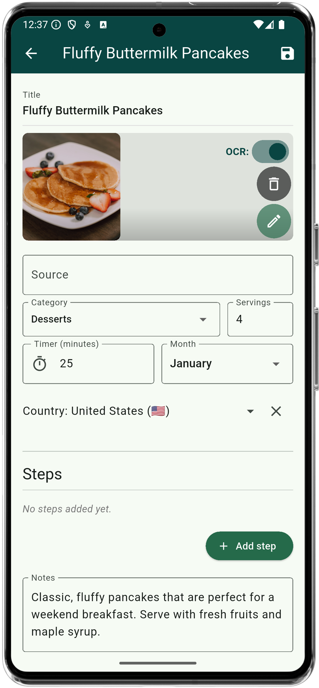

# shefu

Shefu is an **offline** open source (GPLv3) digital cookbook and kitchen assistant, designed to help you organize, cook, and track your recipes in your native language. All of this with local storage (no internet required!).

<a href='https://play.google.com/store/apps/details?id=fr.orvidia.shefu'>
  

</a>

Key Features:

- **Organize Your Recipes**: Easily add, edit, and search your categorized recipes (mains, desserts, etc.). Use advanced search, and filters (like category, country) to find exactly what you need, right when you need it. Search 'egg' and you'll find all your recipes including eggs, even meringue!
- **Scan Recipes with OCR**: Have a recipe in a book or magazine? Just snap a photo! Shefu's built-in OCR (Optical Character Recognition) intelligently extracts the title, ingredients, and steps. (Note: OCR performs best with clear, well-structured text layouts and is NOT available on the fdroid version).
- **Detailed Step-by-Step View**: Follow recipes with clear, easy-to-read instructions. Add images and optional timers to individual steps. Ingredients quantities are automatically adapted to desired servings.
- **Nutrient Tracking & Insights**: Link your ingredients to an extensive included offline nutrient database (Source: Santé Canada). Shefu automatically calculates estimated calories and carbohydrates per serving based on your ingredients and specified serving size, helping you make more informed dietary choices.
- **Shopping List Generation**: (Coming Soon!) Automatically generate a convenient shopping list based on the ingredients needed for your selected recipes.
- **Multi-language Support**: Fully available in English, French, Japanese, and Hungarian.
- **Marmiton recipes import**: Put the source to a www.marmiton.org url when creating a recipe, and the recipe will be imported.
- **Works Offline**: Your recipes are stored locally on your device, ensuring you always have access. No internet required to use the application.

Feel free to help!

## News

New in v2: nutritional informations are automatically generated (for EN and FR only)! Source: Santé Canada (Fichier canadien sur les éléments nutritifs, 2015)-> https://www.canada.ca/fr/sante-canada/services/aliments-nutrition/saine-alimentation/donnees-nutritionnelles/fichier-canadien-elements-nutritifs-fcen-2015.html. This is all done on-device with no internet access required.

**Note: you need to choose ingredients and factors from the drop-down menus to get the nutritional values calculated.**

## Getting Started

Sample:

Supported languages:
  - English
  - Français
  - 日本語
  - Magyar

Documentation will come later.

Tools SVG icons from https://opensourcesvgicons.com/

Nutrients SVG icons from https://www.svgrepo.com/
